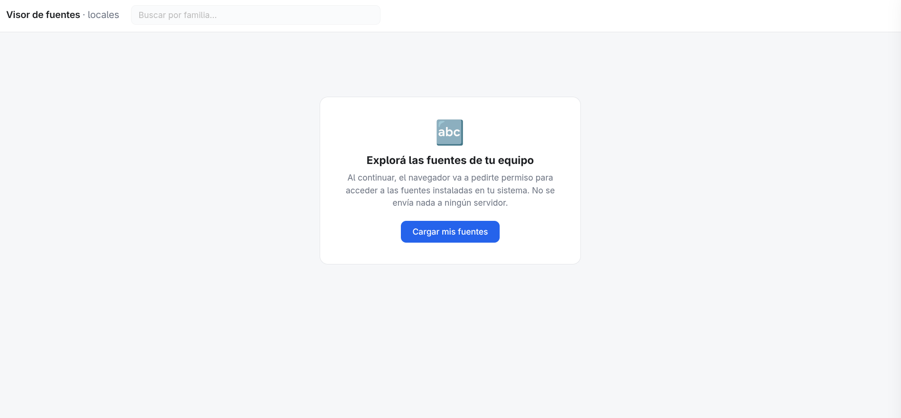
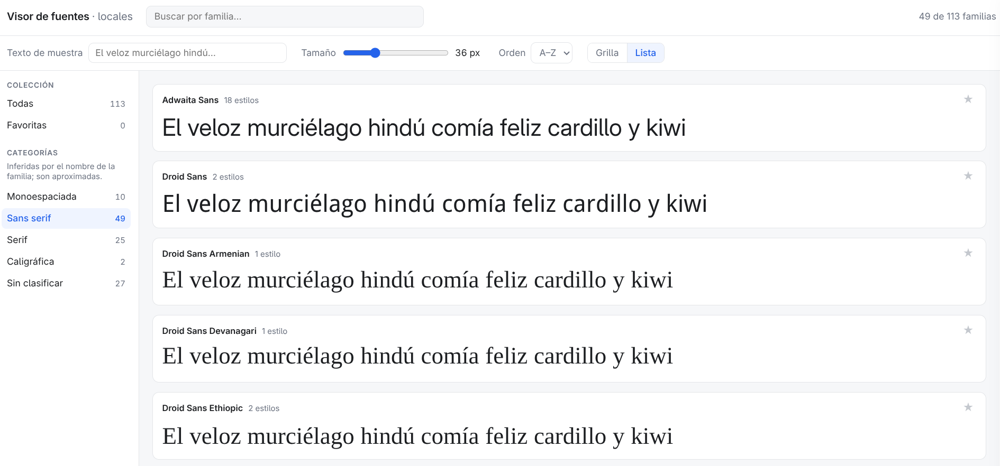

# Visor de fuentes locales

Aplicación web de una sola página para explorar y previsualizar las fuentes
instaladas en tu equipo, renderizadas **con la tipografía real** de cada
familia. Usa la [Local Font Access API](https://developer.mozilla.org/docs/Web/API/Window/queryLocalFonts)
(`window.queryLocalFonts()`) del navegador.

Todo corre en el cliente: **no hay servidor ni build**, y **no se envía nada a
ningún lado**. Basta con abrir `index.html`.

## Tecnología

- HTML + CSS + JavaScript vanilla, sin frameworks ni dependencias externas.
- Tres archivos: `index.html` (markup), `styles.css` (estilos) y `app.js` (lógica).
- Estado (favoritos, ajustes) solo en memoria; no usa `localStorage`.

## Requisitos

- **Chrome o Edge de escritorio** (Chromium). La Local Font Access API no está
  disponible en Firefox, Safari ni en navegadores móviles. Si abrís la app en un
  navegador no compatible, verás un aviso indicándolo.

## Cómo usarla

1. Descargá los tres archivos (`index.html`, `styles.css`, `app.js`) en una
   misma carpeta.
2. Abrí `index.html` con Chrome o Edge (doble clic).

### 1. Cargar las fuentes

Al iniciar, la app muestra una pantalla de bienvenida. El acceso a las fuentes
requiere un gesto del usuario, así que hay que pulsar **«Cargar mis fuentes»**.
El navegador pedirá permiso para acceder a las fuentes locales; al aceptarlo, la
app las lee y las agrupa por familia.

> Si denegás el permiso, la app lo detecta y ofrece reintentar con un mensaje
> explicando cómo volver a habilitarlo.

### 2. Explorar las fuentes

Una vez cargadas, se muestra el visor. Cada familia aparece con su nombre, la
cantidad de estilos y una previsualización renderizada en esa misma fuente.

Funciones disponibles:

- **Buscar por familia** — el campo de la barra superior filtra las familias por
  nombre en vivo (ignora acentos y mayúsculas). Arriba a la derecha se ve el
  contador de resultados (p. ej. «49 de 113 familias»).
- **Texto de muestra** — escribí cualquier texto y todas las previsualizaciones
  visibles se actualizan al instante para mostrar cómo se ve tu texto en cada
  fuente.
- **Tamaño** — el deslizador (12–96 px) ajusta el tamaño de todas las
  previsualizaciones a la vez.
- **Orden** — ordená las familias alfabéticamente A–Z o Z–A.
- **Grilla / Lista** — alterná entre una grilla de tarjetas compacta y una vista
  de lista a lo ancho.
- **Colección** — filtrá entre **Todas** y **Favoritas**. La estrella de cada
  tarjeta marca/desmarca la familia como favorita (se guarda solo en memoria).
- **Categorías** — filtros por tipo (monoespaciada, sans serif, serif,
  caligráfica, etc.) con su contador. Se **infieren de forma heurística** a
  partir del nombre de la familia, así que son aproximadas (la API no expone la
  categoría real).
- **Panel de detalle** — al hacer clic en una familia se abre un panel con una
  previsualización grande, la lista de todos sus estilos/pesos renderizados en la
  fuente, una muestra de glifos (A–Z, a–z, 0–9 y símbolos) y su metadata
  (familia, nombre PostScript, estilo).

## Notas técnicas

- Las fuentes se renderizan de verdad: por cada familia se obtiene el `blob()`
  de la fuente, se crea un `FontFace`, se registra con `document.fonts.add()` y
  se aplica por `font-family`.
- **Carga perezosa**: para soportar catálogos de 1000+ fuentes sin colgarse, cada
  tarjeta registra su `FontFace` solo cuando entra (o se acerca) a la pantalla,
  mediante un `IntersectionObserver`.

## Limitaciones (prototipo — Etapa 0)

- Sin backend, sin persistencia, sin instalación/activación de fuentes ni subida
  de archivos.
- Las categorías son aproximadas (inferidas por nombre).
- Las fuentes en formatos que el navegador no puede cargar muestran un aviso en
  su tarjeta, sin afectar al resto.
